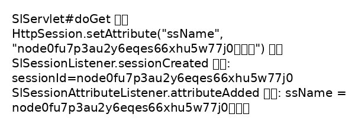

# Week12 - SessionListener 학습 정리

## 2026년 5월 21일 (목요일)

---

## 1차시 학습 내용

- `@WebServlet("/sl")` annotation으로 세션 관련 서블릿을 등록한다.
- `@WebListener` annotation으로 `HttpSessionListener` 와 `HttpSessionAttributeListener`를 구현하고 등록한다.
- 각 리스너 메소드에서 `getServletContext().log()`와 `System.out.println()` 으로 호출 로그를 출력하도록 구현했다.
- `/sl` 서블릿에서 `request.getSession()` 후 `setAttribute("ssName", session.getId() + "홍길동")`을 호출해 attribute 이벤트를 발생시킨다.

### 확인 포인트

- 세션 생성 시 `sessionCreated()` 로그 출력
- 세션에 attribute 추가 시 `attributeAdded()` 로그 출력
- attribute 교체/삭제 시 각각의 메소드 로그 출력

### 결과 화면

결과 로그 이미지는 아래 파일을 참고하세요:

